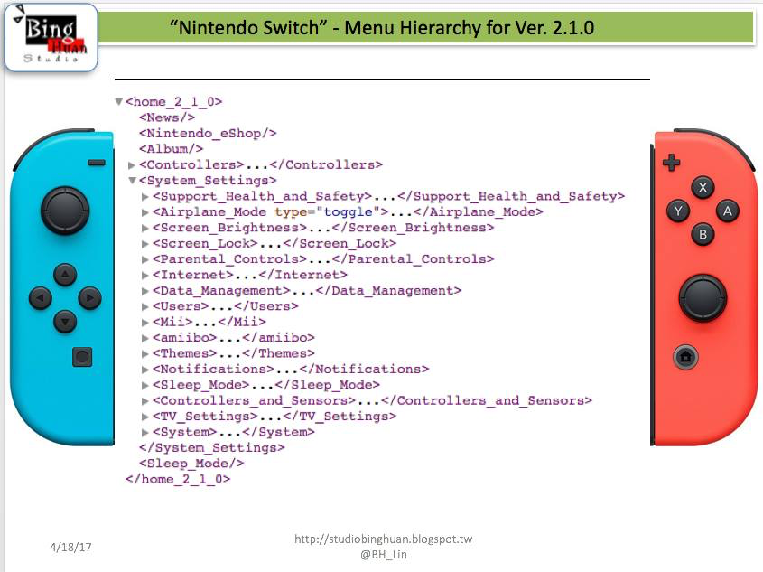

# Nintendo Switch System Layout Documentation



This project documents the Nintendo Switch home menu system layout and settings structure as represented in XML format.

## Overview

This repository contains a comprehensive XML structure (`layout.xml`) that maps out the Nintendo Switch's system interface, including all major menu sections, settings categories, and configuration options available in firmware version 2.1.0.

## Project Structure

- `layout.xml` - Complete XML schema of the Nintendo Switch system menu hierarchy
- `images/` - Screenshots of the Nintendo Switch home screen interface
- `Icon.png` - Project icon
- `README.md` - This documentation file

## Features Documented

The XML layout includes detailed mapping of:

### Main Menu Items
- **News** - System news and updates
- **Nintendo eShop** - Digital storefront access
- **Album** - Screenshot and video gallery
- **Controllers** - Controller management and pairing
- **System Settings** - Comprehensive system configuration

### System Settings Categories

#### Support & Safety
- Health and Safety information
- Safety Precautions
- Error History

#### Connectivity
- **Airplane Mode** - Wireless communication toggle
- **Internet Settings** - Network configuration and testing
- Connection status monitoring

#### Display & Audio
- **Screen Brightness** - Manual and auto-brightness controls
- **Screen Lock** - Sleep mode security settings
- **TV Settings** - Resolution, RGB range, screen size adjustment
- **Themes** - Basic White/Black theme selection
- Audio configuration options

#### User Management
- **Parental Controls** - Content and feature restrictions
- **Users** - Account management and user selection
- **Mii** - Custom character creation and editing

#### Data & Storage
- **Data Management** - Software and save data organization
- **amiibo** - NFC figure data management

#### Hardware Controls
- **Controllers and Sensors** - Calibration and testing tools
- **Sleep Mode** - Auto-sleep configuration
- **Notifications** - System alert preferences

#### System Information
- System updates (Current version: 2.1.0)
- Console settings (nickname, language, region)
- Serial information for all components
- Legal notices and licensing

## XML Structure

The XML follows a hierarchical structure representing the menu navigation:

```xml
<home_2_1_0>
    <System_Settings>
        <Category>
            <Setting type="toggle">
                <Option>Description</Option>
            </Setting>
        </Category>
    </System_Settings>
</home_2_1_0>
```

## Usage

This documentation can be used for:
- Understanding Nintendo Switch system architecture
- Developing homebrew applications that interact with system settings
- Creating user interface mockups or emulation projects
- Educational purposes for game console interface design

## Version Information

- **Firmware Version**: 2.1.0
- **Documentation Status**: Complete system menu mapping
- **Last Updated**: Based on Nintendo Switch firmware 2.1.0